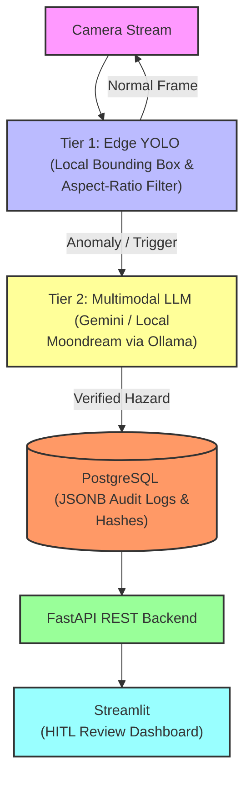

# GazeLoop

Gazeloop is a real-time, hybrid edge-AI security and safety monitoring system engineered to detect critical anomalies (such as slips, falls, or safety violations) from high-speed video streams.


HITL dashboard (Streamlit)


## Architecture & Data Flow



## Core Components

1. **Tiered Edge Filtering:** Local YOLO-based bounding box filtering and geometric aspect-ratio checks act as a high-speed filter to catch potential incidents instantly without flooding network bandwidth.

2. **Multimodal LLM Verification:** When an anomaly is suspected, frames are offloaded to Gemini (gemini-3.6-flash) or local edge models (Ollama / Moondream) for deep contextual reasoning and tool-call validation.

3. **Event-Driven Async Queue:** Built using Python's asyncio.Queue message broker pattern to ensure continuous, non-blocking frame ingestion from live streams.

4. **Cryptographic & Structured Audit Trail:** Stores state changes, snapshots, and reasoning payloads securely inside PostgreSQL using native JSONB columns.

5. **HITL Review Dashboard:** A decoupled FastAPI and Streamlit interface enabling security operators to review pending alerts, inspect diagnostic reports, and manage incident lifecycles (PENDING -> CONFIRMED / DISMISSED).

## Getting Started

### Prerequisites

- Python 3.10+
- A Google AI Studio API key (GEMINI_API_KEY)
- Install Ollama

```
sudo apt-get update && sudo apt-get install -y zstd
pip install google-genai opencv-python python-dotenv ollama
curl -fsSL https://ollama.com/install.sh | sh
ollama run moondream
```

### Running the Agent

Place your target images in the project directory (e.g., demo_video.mp4) and run:

```
python main.py -i demo_video.mp4
```

### Running the Dashboard

Launch the Streamlit dashboard to review pending AI alerts and inspect captured evidence frames:

```
uvicorn hitl_api:app --reload --port 8000
```

```
streamlit run hitl_dashboard.py
```

## Running Automated Tests

GazeLoop uses `pytest` for automated testing.

The test suite performs several basic checks:

Verifies that Python source files compile successfully.
Verifies that requirements.txt exists and is not empty.
Verifies that required third-party Python packages can be imported.
Verifies that the main GazeLoop application modules can be imported.

### Install Test Dependencies

Activate your Python virtual environment and install the project dependencies:

```
source .venv/bin/activate

python -m pip install -r requirements.txt
```

### Run Tests

From the repository root:

```
python -m pytest -q
```

A successful run should report all tests as passing, for example:

4 passed

## Running with Docker

You can also run GazeLoop inside a container with live graphical X11 display forwarding (ideal for Linux/WSL2 environments).

- Build the container image using Docker Compose:

```
docker-compose build --no-cache
```

### Run the Container

Ollama is a separate container

** if you have ollama on host machine, stop the service first

```
sudo systemctl stop ollama
```

1. First, start Ollama

```
docker-compose up -d ollama
```

2. download the model inside the Ollama container

```
docker-compose exec ollama ollama pull moondream
```

3. check it

```
docker-compose exec ollama ollama list
```

- Input video / camera source

```
docker-compose run --rm gazeloop -i data/demo_video.mp4
```

or 

```
docker-compose run --rm gazeloop
```

** ollama run in docker, and the it should set to 

```
OLLAMA_HOST=http://ollama:11434
```

## SQL

if run in native machine, edit `.env` and set `PGHOST=localhost`

```
PGHOST=localhost  
```

if run in docker

```
PGHOST=host.docker.internal
```

dashboard load data from SQL instead of local file

```
CREATE TABLE IF NOT EXISTS audit_logs (
    id SERIAL PRIMARY KEY,
    timestamp TIMESTAMPTZ NOT NULL DEFAULT NOW(),
    snapshot_path TEXT,
    model_metadata JSONB,
    llm_payload JSONB,
    hitl_decision VARCHAR(50) DEFAULT 'PENDING',
    prev_hash VARCHAR(64) NOT NULL,
    current_hash VARCHAR(64) NOT NULL
);
```

## Acknowledgements

* **Test Videos**: Sample video clips used for local testing in this repository are sourced from the **Fall Detection Dataset** by [Unidata](https://unidata.pro/datasets/fall-detection/) via Kaggle.
* **License**: Licensed under [Creative Commons Attribution-NonCommercial-NoDerivatives 4.0 International (CC BY-NC-ND 4.0)](https://creativecommons.org/licenses/by-nc-nd/4.0/).
* *Note: These sample clips are used strictly for local educational and non-commercial testing purposes.*