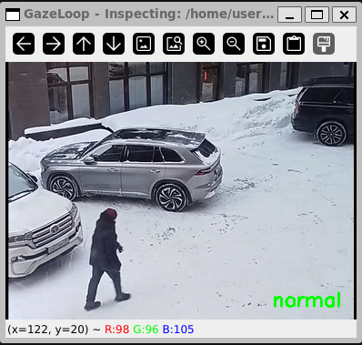
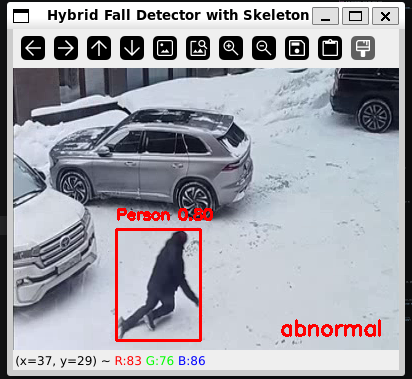
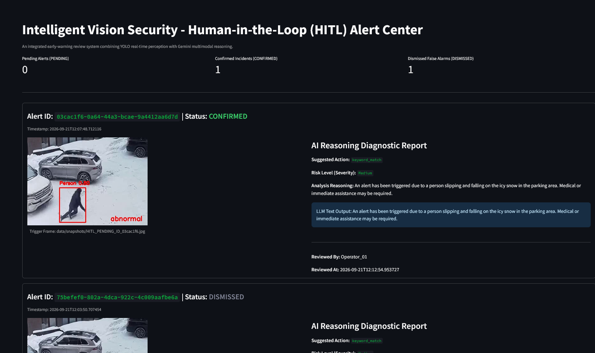

# GazeLoop

GazeLoop is an intelligent, multimodal AI vision-guard agent powered by Google Gemini 3.6-Flash, OpenCV, and Python. It inspects surveillance imagery or video streams for safety hazards, triggers automated alerts, and provides interactive manual frame-stepping with real-time status overlays.




HITL dashboard (Streamlit)



## Key Features

- **Multimodal Inspection:** Powered by `gemini-3.6-flash` supporting both JPEG and PNG image frames.
- **Hybrid Tiered Detection (YOLO + LLM):** 
  - *Tier 1:* Edge-optimized YOLO inference and geometric bounding box aspect-ratio checks run locally to instantly flag potential anomalies (such as horizontal falls) without hammering the API.
  - *Tier 2:* When triggered, frames are passed to Gemini for deep contextual verification and tool invocation.
- **Human-in-the-Loop (HITL) Review Dashboard:** A built-in Streamlit dashboard (`dashboard.py`) that manages an alert queue (`hitl_alerts_queue.json`), allowing security operators to review snapshots, check AI reasoning reports, and **Confirm** or **Dismiss** alerts.
- **Dual Alert Mechanism:**
    - Automatically invokes the `trigger_alert` tool when Gemini detects an anomaly.
    - Fallback keyword matcher (`alert`, `abnormal`, `fire`, `fall`) scanning the model's text response.
- **Interactive Manual Stepping & Cooldowns:** Press any key in the OpenCV window to advance frame-by-frame through images or video streams, or `q` to quit.
- **On-Screen Status Overlay:** Renders color-coded status badges directly in the bottom-right corner of the frame:
    - `normal` (Green) — Safe conditions.
    - `abnormal` (Red) — Hazard or anomaly detected.
- **Flexible Input Routing:** Switch effortlessly between default static demo images, custom images, or video files.

## Getting Started

### Prerequisites

- Python 3.10+
- A Google AI Studio API key (GEMINI_API_KEY)

```
pip install google-genai opencv-python python-dotenv
```

### Running the Agent

Place your target images in the project directory (e.g., demo1.png, demo2.png) and run:

```
python main.py
```

### Running the Dashboard

Launch the Streamlit dashboard to review pending AI alerts and inspect captured evidence frames:

```
streamlit run dashboard.py
```

## Running with Docker

You can also run GazeLoop inside a container with live graphical X11 display forwarding (ideal for Linux/WSL2 environments).

- Build the container image using Docker Compose:

```
docker-compose build --no-cache
```

### Run the Container

- Input video / camera source

```
docker-compose run --rm gazeloop -i data/demo_video.mp4
```

or 

```
docker-compose run --rm gazeloop
```

## Acknowledgements

* **Test Videos**: Sample video clips used for local testing in this repository are sourced from the **Fall Detection Dataset** by [Unidata](https://unidata.pro/datasets/fall-detection/) via Kaggle.
* **License**: Licensed under [Creative Commons Attribution-NonCommercial-NoDerivatives 4.0 International (CC BY-NC-ND 4.0)](https://creativecommons.org/licenses/by-nc-nd/4.0/).
* *Note: These sample clips are used strictly for local educational and non-commercial testing purposes.*